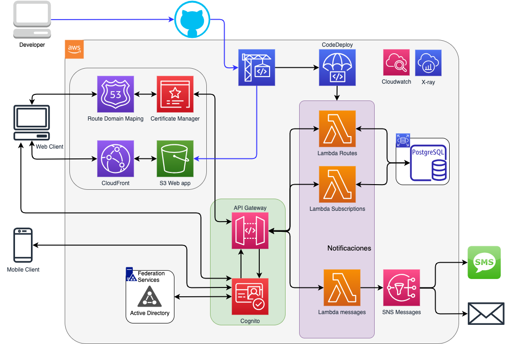
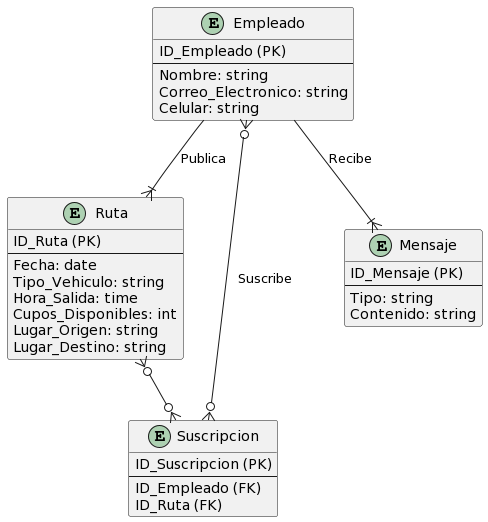

## Parte 1
Como parte de los proyectos de sostenibilidad de la compañía, se está buscando una solución que permita que los empleados publiquen sus rutas de transporte e indiquen los cupos que tienen disponibles en su vehículo, la hora de salida, el lugar de origen y el destino y que permita a los demás compañeros inscribirse en alguna de las rutas.

# Solución de Carpooling para la Sostenibilidad de la Compañía diagrama arquitectura

# Modelos

#### Descripción del Modelo Entidad-Relación:

**Entidades**:
1. **Empleado**:
   - Atributos: ID_Empleado (PK), Nombre, Correo_Electronico, Celular.
2. **Ruta**:
   - Atributos: ID_Ruta (PK), Fecha, Tipo_Vehiculo, Hora_Salida, Cupos_Disponibles, Lugar_Origen, Lugar_Destino.
3. **Suscripcion**:
   - Atributos: ID_Suscripcion (PK), ID_Empleado (FK), ID_Ruta (FK).
4. **Mensaje**:
   - Atributos: ID_Mensaje (PK), Tipo, Contenido.

**Relaciones**:
1. **Publica**: Un **Empleado** puede publicar múltiples **Rutas**, pero cada **Ruta** es publicada por un solo **Empleado**.
2. **Suscribe**: Un **Empleado** puede suscribirse a múltiples **Rutas**, y cada **Ruta** puede tener múltiples **Empleados** suscritos.
3. **Recibe**: Un **Empleado** puede recibir múltiples **Mensajes**.

## Tecnologías, lenguajes de programación y frameworks

### 1. **Frontend Web**:
- **Tecnología**: React
  - **Justificación**: React es un framework de JavaScript ampliamente usado y con amplia comunidad, facilita el desarrollo y mantenimiento de aplicaciones web complejas.

### 2. **Frontend Móvil**:
- **Tecnología**: React Native
  - **Justificación**: Con React Native, podemos desarrollar aplicaciones móviles nativas para Android e iOS con un único código base. Esto acelerará el proceso de desarrollo y reduce costos.

### 3. **Backend**:
- **Lenguaje**: Python
  - **Justificación**: Python es versátil y ampliamente adoptado, especialmente fuerte en integraciones y desarrollos web.
  
- **Framework**: FastAPI
  - **Justificación**: Flexible para construir APIs web, rápido y compatible con estandares como OpenAPI (documentación y testing).

### 4. **Autenticación y Autorización**:
- **Tecnología**: Amazon Cognito con integración a Directorio Activo mediante ADFS (Active Directory Federation Services)
  - **Justificación**: Amazon Cognito permite la federación de identidades con sistemas externos, incluido el Directorio Activo a través de ADFS, es robusta y escalable para autenticación y autorización.

### 5. **Base de datos**:
- **Tecnología**: PostgreSQL en Amazon RDS
  - **Justificación**: PostgreSQL es robusto y escalable. Al utilizar Amazon RDS, se facilita la gestión, la configuración, y la escalabilidad de la base de datos, beneficiándose de la infraestructura de AWS.

### 6. **Notificaciones**:
- **Tecnología**: Amazon SNS (Simple Notification Service)
  - **Justificación**: Amazon SNS es un servicio de AWS que permite enviar notificaciones a usuarios a través de diferentes formatos, incluidos SMS y correos electrónicos.

### 7. **Hosting y Despliegue**:
- **Tecnologías**:
  - **AWS Lambda**: Para ejecutar el código backend en respuesta a eventos, como solicitudes HTTP a través de API Gateway.
  - **Amazon API Gateway**: Para crear, publicar, mantener, monitorear y proteger las APIs REST a cualquier escala.
  - **Amazon S3**: Para almacenar y servir el frontend de la aplicación y otros recursos estáticos.
  - **Amazon CloudFront**: CDN para distribuir el contenido estáticamente alojado en S3 a nivel global y reducir latencias.
  - **Amazon Route 53**: Servicio de DNS para dirigir el tráfico web a los recursos adecuados, como CloudFront o API Gateway.
  - **Justificación**: La combinación de AWS Lambda con API Gateway permite una arquitectura serverless escalable y de bajo mantenimiento. S3 y CloudFront garantizan una entrega rápida y confiable del frontend y otros recursos estáticos. Route 53 proporciona una gestión confiable del DNS.

## Autenticar a los empleados de la compañía 
•	La aplicación sólo puede ser accedida por los usuarios de la compañía. 
•	Para facilitar la gestión es necesario que la aplicación use el directorio activo para autenticación y autorización. 

Se usará Amazon Cognito con integración a Directorio Activo mediante ADFS.

## Demás funcionalidades
Se decide implementar 3 Lambdas de AWS: Rutas (registrar, cancelar, ver), Suscripciones (suscribir, ver) y Mensajes (e-mail, sms)

### Lambda para Rutas:

- **registrarRuta**: Esta función  permitirá recibir la información de la ruta proporcionada por el empleado y almacenarla en una base de datos (por ejemplo, PostgreSQL). Los datos incluirán fecha, tipo de vehículo, hora de salida, cupos disponibles, lugar de origen y lugar de destino.
- **cancelarRuta**: Esta función permitirá que un empleado cancele una ruta que ha publicado. Además de marcar la ruta como cancelada en la base de datos, esta función enviará notificaciones a los suscriptores de la ruta. Esto podría ser una combinación de una notificación por correo electrónico y SMS.
- **verRutasDisponibles**: Esta función me permitirá devolver una lista de rutas disponibles basadas en los criterios mencionados (fecha actual, cupos disponibles, hora futura).

### Lambda para Suscripciones:

- **suscribirseRuta**: Esta función permitirá que un empleado se suscriba a una ruta disponible. Después de suscribir al empleado a la ruta en la base de datos, notificará al dueño de la ruta por correo electrónico y SMS.
- **verSuscriptoresRuta**: Esta función me permitirá que el dueño de la ruta vea quién se ha suscrito a su ruta. Recuperará la lista de suscriptores de la base de datos y luego, utilizando una conexión con el directorio activo, recuperará detalles adicionales como el nombre, correo electrónico y número de celular de cada suscriptor.

### Lambda para Mensajeria
- **mensajeriaSMS**: Esta función interactua por medio del ApiGateway y SNS para generar los mensajes de SMS
- **mensajeriaEMAIL**: Esta función interactua por medio del ApiGateway y SNS para generar los mensajes de e-mail

Para ver la metodología vaya al archivo [Metodologia](Metodologia.md)